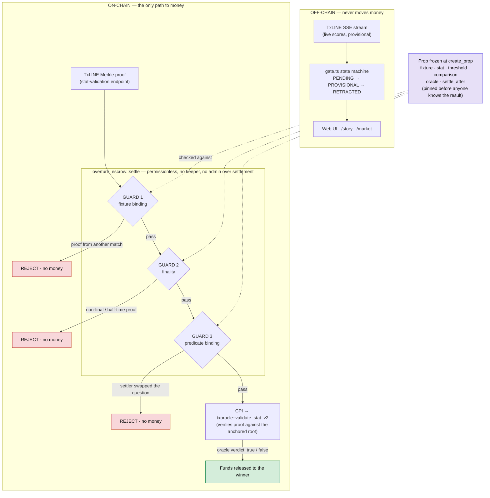
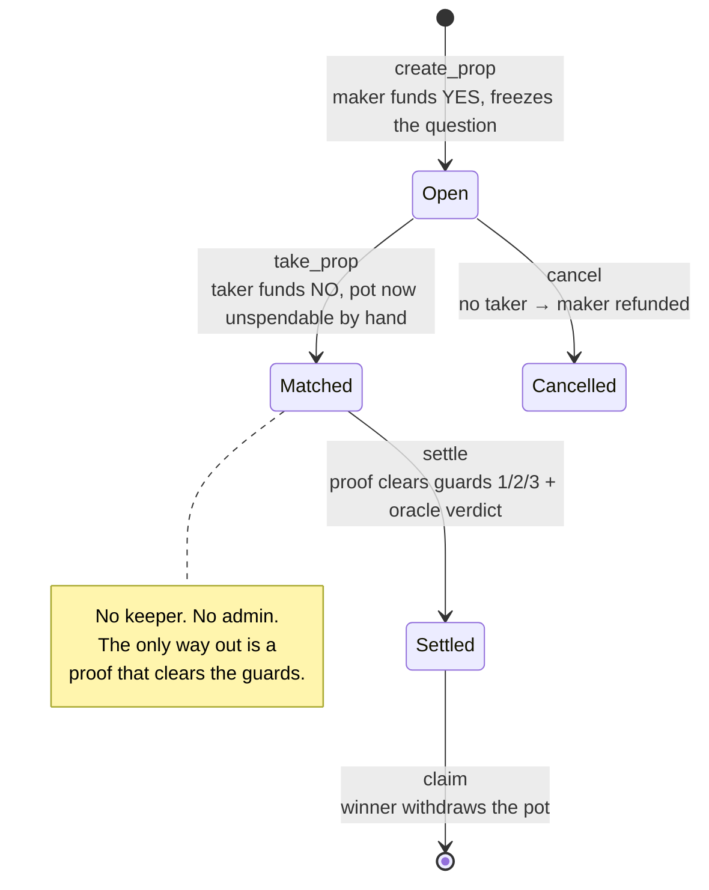
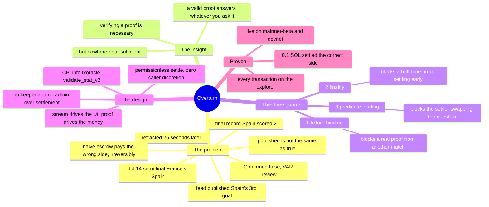

# Overturn — architecture

Three views, in the order a judge should read them: **what moves money** (the guarded
settle path), **the prop's life** (its states), and **the why** (the whole thesis on one
page). Everything below is enforced in
[`overturn_escrow/programs/overturn_escrow/src/lib.rs`](overturn_escrow/programs/overturn_escrow/src/lib.rs).

## 1 · The two lanes — a stream that can only light a UI, and a proof that can move money

The feed is never trusted with funds. The only path to money is a Merkle proof that clears
three guards **before** the oracle is ever asked, checked against a prop frozen before kickoff.

The three guards are the difference between *"we verified a proof"* and *"we settled
correctly."* A valid proof still answers whatever question you ask it, about whatever match
you hand it. Guards 1–3 run on plaintext that was frozen before kickoff, so the caller has
no discretion left by the time the oracle is asked.

## 2 · The prop's life — nothing exits `Matched` except a proof

## 3 · The whole thesis on one page

## Where each piece lives

| Concern | File |
|---|---|
| Escrow, the three guards, the CPI | `overturn_escrow/programs/overturn_escrow/src/lib.rs` |
| Stream → UI state machine (never money) | `src/gate.ts` |
| Naive-vs-guarded replay on the real semi-final | `src/replay.ts` |
| Ask the real mainnet oracle about the phantom | `src/verify.ts` |
| One-instruction-at-a-time escrow driver | `src/market-*.ts` |
